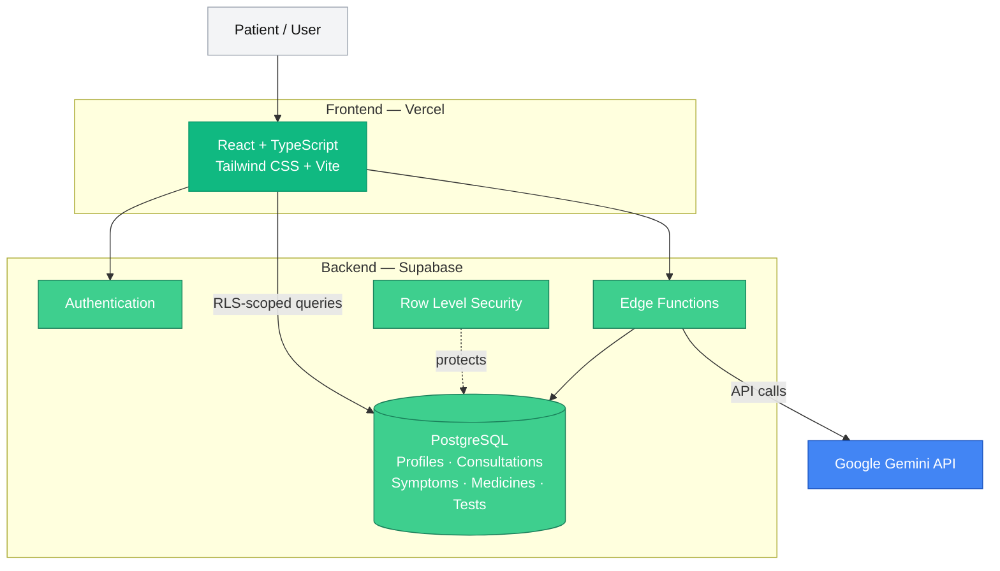

# Nura

A patient companion app for keeping track of everything around a medical consultation — symptoms, prescriptions, lab reports, appointments, and follow-ups — instead of leaving it scattered across notes and memory.

Nura groups related records into **Health Episodes**: once a health concern starts, everything connected to it (symptoms, consultations, follow-ups) lives together in one place, while a separate timeline keeps the full history across every episode.

> **Academic prototype.** Nura is an educational project and isn't meant to diagnose conditions or replace advice from a doctor.

---

## Features

**Health Episodes**
Start an episode when a new health concern comes up and track it from the first symptoms through consultations and any follow-ups. Each episode has its own story, while the health timeline ties everything together across episodes.

**Pre-consultation prep**
Log your symptoms, how severe they are, and how long they've lasted. Nura suggests questions you might want to bring up with the doctor.

**Consultation records**
After an appointment, record the notes, the doctor and clinic, the date and time, any follow-up plan, and the prescriptions or lab reports tied to that visit.

**Prescription analysis**
Upload a photo of a prescription and Nura pulls out the medicine name, dosage, frequency, and instructions, plus general educational info on each medicine.

**Lab report explanation**
Upload a supported lab report and Nura extracts the parameters, values, units, and reference ranges, then lays them out more clearly without changing what the report actually says.

**Context-aware consultation questions**
When you're prepping for a follow-up, Nura can draw on the previous consultation, the latest follow-up, and any prescriptions or lab reports you've linked. Each prep cycle stays separate from the last.

**Follow-up tracking**
Record how things are going after a consultation — recovery, current symptoms, whether you're keeping up with the medicine, side effects, new questions.

**Health timeline**
A combined view across all episodes, plus a scoped view inside each episode showing only what's connected to that particular issue.

---

## Tech stack

- **Frontend:** React, TypeScript, Vite, Tailwind CSS, Lucide Icons
- **Backend:** Supabase, PostgreSQL, Supabase Authentication, Row Level Security, Supabase Edge Functions, TypeScript/Deno
- **AI:** Google Gemini API, called from Supabase Edge Functions rather than directly from the browser
- **Deployment:** Vercel for the frontend, Supabase for the backend, with Git/GitHub for version control

---

## Architecture



---

## Data and security

Supabase Authentication and PostgreSQL Row Level Security keep each user's data isolated. AI requests go through server-side Edge Functions, so the Gemini API key never reaches the browser. Health records are stored in PostgreSQL and reused across the app instead of being re-processed by the AI every time.

---

## Running locally

Clone the repository:

```bash
git clone <repository-url>
cd NURA
```

Install dependencies:

```bash
npm install
```

Add the frontend environment variables:

```env
VITE_SUPABASE_URL=your_supabase_project_url
VITE_SUPABASE_ANON_KEY=your_supabase_anon_key
```

Start the dev server:

```bash
npm run dev
```

---

## Live demo

https://nuraforhealth.vercel.app

---

## Project context

Nura was built as a College Engineering Project (CEP), looking at how web tech and generative AI can help organize the information around a medical consultation. The focus is on helping patients keep track of their own information, not on diagnosis or treatment.

---

## Disclaimer

Nura is an academic prototype. It doesn't diagnose conditions, prescribe treatment, or replace a consultation with a qualified healthcare professional. AI-generated content can be wrong and shouldn't be treated as the sole basis for a medical decision.
